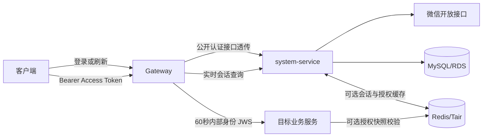
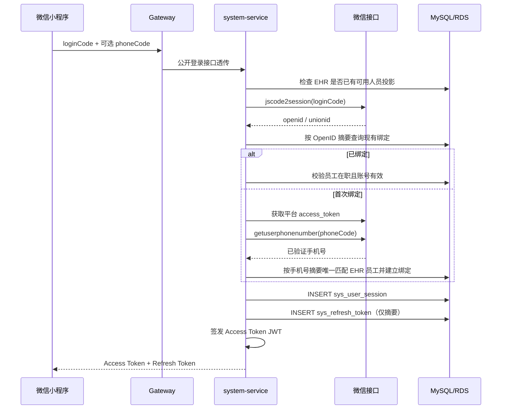
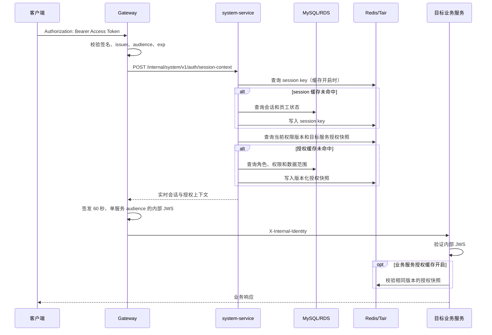

# 认证、Token、会话与 Redis 存储设计

状态：已实现  
适用服务：Gateway、system-service、全部受保护业务服务  
适用客户端：微信小程序、管理后台  
更新时间：2026-08-04

## 1. 文档目的

本文说明当前系统中登录、访问令牌、刷新令牌、在线会话和实时授权的完整处理流程，重点回答：

- 登录成功后服务端生成了哪些凭证；
- Access Token、Refresh Token、数据库和 Redis 分别保存什么；
- 为什么登录后 Redis 可能没有任何会话 key；
- 受保护请求、刷新、退出和权限变化如何生效；
- Redis 开关、键模型、TTL、故障语义和排查方法是什么。

本文以当前代码为准，不把“计划中的方案”描述为已经实现的行为。

## 2. 核心结论

1. Access Token 是 RS256 签名的短期 JWT，只返回客户端，不在数据库或 Redis 保存。
2. Refresh Token 原文只返回客户端一次，服务端仅在数据库保存其 HMAC-SHA256 摘要。
3. `sys_user_session` 和 `sys_refresh_token` 是会话状态的权威存储。
4. Redis 不保存 Access Token 或 Refresh Token 原文，只保存可重建的在线会话投影和版本化授权快照。
5. Redis 会话缓存默认关闭；即使开启，登录接口也不会立即创建会话 key。
6. 用户首次携带 Access Token 请求受保护接口时，system-service 才按需从数据库加载会话并写入 Redis。
7. Gateway 不直接访问 Redis。它每次验证外部 JWT 后，都调用 system-service 获取实时会话与授权上下文。
8. 退出、刷新令牌重放、会话过期、员工离职或账号冻结都通过权威会话检查阻止旧 JWT 继续使用。

## 3. 组件职责

| 组件 | 主要职责 | 是否读写 Redis |
| --- | --- | --- |
| 客户端 | 获取并提交登录凭证；安全保存 Access Token 和 Refresh Token | 否 |
| Gateway | 验证外部 JWT；实时查询会话；签发 60 秒内部身份 JWS | 否 |
| system-service | 登录、绑定、会话、刷新令牌轮换、实时授权、退出 | 按配置读写 |
| 业务服务 | 验证 Gateway 内部身份；执行接口与数据范围授权 | 授权缓存开启时读取 |
| MySQL/RDS | 保存员工、绑定、会话、刷新令牌摘要和审计，是权威状态 | 不适用 |
| Redis/Tair | 缓存在线会话、授权快照、权限版本和管理员登录失败计数 | 不适用 |
| 微信开放接口 | 登录 code 换 OpenID；手机号 code 换已验证手机号 | 否 |

## 4. 总体认证链路



外部 Access Token 只在客户端与 Gateway 之间使用。Gateway 验证外部 Token 并完成实时会话检查后，重新签发仅对单个目标服务有效的内部身份 JWS。业务服务不信任客户端直接提交的员工、角色或权限请求头。

## 5. 存储分工

### 5.1 凭证与状态存储矩阵

| 数据 | 客户端 | MySQL/RDS | Redis | 说明 |
| --- | --- | --- | --- | --- |
| Access Token 原文 | 是 | 否 | 否 | 15 分钟短期 RS256 JWT |
| Refresh Token 原文 | 是 | 否 | 否 | 48 字节随机数的 URL-safe Base64 表示 |
| Refresh Token 摘要 | 否 | `sys_refresh_token.token_hash` | 否 | 使用独立 pepper 的 HMAC-SHA256 |
| 登录会话状态 | 否 | `sys_user_session` | 可选缓存 | 数据库为权威，Redis 可重建 |
| 会话员工最小投影 | 否 | 通过会话和员工表查询 | 可选 | key 按 sessionId 隔离 |
| 角色、权限、数据范围 | JWT 不携带完整集合 | 角色权限相关表 | 可选版本化快照 | Gateway 每次请求实时获取 |
| 当前权限版本 | JWT 携带签发时版本 | `sys_employee.authz_version` | 可选短 TTL | 用于拒绝旧权限 Token |
| 微信 OpenID/UnionID | 否 | 摘要及加密密文 | 否 | 不保存明文 |
| 微信平台 access_token | 否 | 否 | 否 | 当前保存在 system-service 进程内存中 |
| 管理员失败次数 | 否 | 否 | 可选 | 仅保存账号/IP不可逆摘要和计数 |

### 5.2 Access Token

Access Token 由 system-service 使用认证专用 RSA 私钥签发，Gateway 使用对应公钥验签。当前默认 TTL 为 15 分钟，主要声明包括：

| 声明 | 含义 |
| --- | --- |
| `iss` | `biel-life-camp`，可配置 |
| `aud` | `biel-life-camp-gateway`，可配置 |
| `sub` | 本地员工 ID |
| `sid` | 登录会话 UUID |
| `authz_ver` | Token 签发时的权限版本 |
| `client_type` | `MINI_PROGRAM` 或 `ADMIN_WEB` |
| `amr` | `wechat` 或 `password` |
| `iat`、`nbf`、`exp` | 签发、生效和到期时间 |
| `jti` | 本次 JWT 唯一标识 |

Access Token 不携带完整角色、权限和数据范围。这样权限变化不需要等待 JWT 自然到期，Gateway 可以通过实时会话查询发现 `authz_ver` 已过期并返回 `AUTHZ_STALE`。

### 5.3 Refresh Token

Refresh Token 使用 48 字节安全随机数生成。服务端返回原文后，使用：

```text
HMAC-SHA256(AUTH_TOKEN_PEPPER, "refresh:" + rawRefreshToken)
```

计算摘要，并仅把 64 位十六进制摘要写入 `sys_refresh_token.token_hash`。因此数据库泄露时不能直接取得可使用的 Refresh Token。

客户端必须把 Refresh Token 当作高敏感凭证：不得写入日志、URL、埋点、异常消息或普通分析平台。

### 5.4 数据库权威状态

`sys_user_session` 保存：

- 会话 ID、员工 ID、客户端类型、认证方式；
- `ACTIVE` 或 `REVOKED` 状态；
- 签发时权限版本；
- 绝对到期时间、空闲到期时间、最近访问时间；
- 撤销时间和撤销原因。

`sys_refresh_token` 保存：

- Token 记录 ID、所属会话、Token 族 ID；
- 当前 Token 摘要和父 Token ID；
- `ACTIVE`、`CONSUMED` 或 `REVOKED` 状态；
- 到期时间和消费时间。

Refresh Token 族用于检测重放：已经消费的旧 Token 再次出现时，系统撤销整个 Token 族和所属会话。

组织主数据映射尚未完成期间，EHR 同步继续把部门编码和名称保存到
`sys_employee.primary_org_code`、`sys_employee.primary_org_name`，本地组织主键
`primary_org_id` 可以为空。认证接口、内部身份和授权缓存统一把这种状态表示为字符串 `"0"`：

- `"0"` 只表示本地组织尚未解析，不是 EHR 部门编码或真实组织主键；
- 未解析组织不阻塞员工登录、会话校验和个人身份查询；
- 未解析组织不能获得任何基于组织的数据范围；
- 后续组织主数据上线后，按 `primary_org_code` 映射并回填 `primary_org_id`，无需改变认证协议。

### 5.5 默认时间策略

| 对象 | 默认时间 | 续期方式 |
| --- | --- | --- |
| 外部 Access Token | 15 分钟 | 不能续期，只能通过 Refresh Token 换发 |
| 登录会话绝对有效期 | 30 天 | 不续期，是单次会话最长寿命 |
| 登录会话空闲有效期 | 7 天 | 每次有效访问或刷新时延长，但不超过绝对有效期 |
| Redis 在线会话 | 不超过会话剩余时间 | 默认至少间隔 1 分钟改写 |
| 数据库 `last_seen_at` | 随会话存在 | Redis 主路径下默认至少间隔 5 分钟持久化 |
| 授权快照 | 15 分钟 | 未命中时从数据库重建 |
| 当前权限版本 | 5 分钟 | 未命中时从数据库重建 |
| Gateway 内部身份 JWS | 60 秒 | 每个受保护请求重新签发 |
| Gateway 实时鉴权调用 | 3 秒超时 | 超时返回 503，不放行请求 |
| 管理员登录失败计数 | 15 分钟窗口 | 首次失败设置 TTL |

## 6. 微信登录流程

登录接口：

```text
POST /api/system/v1/auth/wechat/login
```



登录事务成功后：

- 数据库已经存在会话和 Refresh Token 摘要；
- 客户端已拿到两个原始 Token；
- Redis 可能仍然一个会话 key 都没有，这是当前懒加载设计的正常表现。

管理后台密码登录走同一套会话和 Token 创建逻辑，只是认证方式为 `PASSWORD`，并额外使用 Redis 登录失败限流器。

## 7. 受保护接口流程与 Redis 懒加载



Gateway 对每个受保护请求都调用 system-service。Redis 的作用是降低 system-service 重复读取会话、员工、角色和权限表的成本，不是绕过实时会话校验。

## 8. Redis 键模型

默认使用 `spring.data.redis.database=0`。排查时必须确认客户端查看的是相同 Redis 实例和相同 database。

### 8.1 在线会话

```text
biel:auth:session:v1:{<sessionId>}
```

值为显式 JSON，包含会话状态、客户端类型、认证方式、两个到期时间、员工最小投影、权限版本和最近续期时间。不包含 Access Token、Refresh Token、OpenID、手机号或密码。

TTL 取以下两者的较早时间：

```text
min(session.absoluteExpiresAt, session.idleExpiresAt) - now
```

默认 Redis 活跃时间最小改写间隔为 1 分钟，数据库活跃时间最小持久化间隔为 5 分钟。

### 8.2 版本化授权快照

```text
biel:security:authorization:v1:{<employeeId>}:<targetService>:<authzVersion>
```

默认 TTL 为 15 分钟。值包含员工最小身份、目标服务、权限版本、角色、目标服务权限和数据范围。同一员工的多个会话可共享同一份授权快照。

### 8.3 当前权限版本

```text
biel:security:authz-version:v1:{<employeeId>}
```

默认 TTL 为 5 分钟。缓存缺失时 system-service 回源数据库读取 `sys_employee.authz_version`。

### 8.4 管理员登录失败限流

```text
biel:security:admin-login:v1:account:<账号摘要>
biel:security:admin-login:v1:ip:<IP摘要>
```

仅密码登录失败时产生，默认窗口 15 分钟。成功登录会删除账号维度计数，但保留 IP 维度计数以约束批量账号探测。

## 9. Refresh Token 轮换流程

接口：

```text
POST /api/system/v1/auth/token/refresh
```

处理步骤：

1. 对客户端提交的原始 Refresh Token 计算 HMAC 摘要。
2. 使用 `SELECT ... FOR UPDATE` 锁定对应 Token 记录。
3. Token 不存在时返回 `AUTH_REFRESH_INVALID`。
4. Token 已是 `CONSUMED` 或 `REVOKED` 时，按重放处理，撤销整个 Token 族及会话。
5. 删除旧的 Redis 在线会话 key，避免继续读取旧权限版本。
6. 锁定并校验数据库会话、员工状态和到期时间。
7. 把当前 Refresh Token 更新为 `CONSUMED`。
8. 生成下一代 Refresh Token，保存新摘要，并通过 `parent_token_id` 连接轮换链。
9. 更新会话空闲到期时间和权限版本。
10. 签发新的 Access Token，并把新的原始 Refresh Token 返回客户端。

客户端收到刷新成功响应后必须原子替换本地两个 Token。旧 Refresh Token 不得再次使用。

## 10. 退出与撤销

### 10.1 退出当前会话

```text
POST /api/system/v1/auth/logout
```

系统依次：

1. 删除 Redis 会话 key；
2. 把 `sys_user_session.status` 更新为 `REVOKED`；
3. 撤销该会话下仍为 `ACTIVE` 的 Refresh Token；
4. 写入认证审计。

### 10.2 退出全部会话

```text
POST /api/system/v1/auth/logout-all
```

系统查询员工所有有效会话，并逐个执行相同撤销流程。

Access Token 本身不会加入 Redis 黑名单，但 Gateway 每次受保护请求都会实时检查 `sid` 对应会话。因此会话撤销后，即使 JWT 尚未自然到期，也会被拒绝。

## 11. 权限变化

Access Token 只携带 `authz_ver`，不携带完整权限。权限变化时应更新员工 `authz_version` 并发布当前版本：

- 旧 JWT 请求进入 system-service 时发现版本不一致，返回 `AUTHZ_STALE`；
- 客户端使用有效 Refresh Token 轮换后获得包含新版本的新 JWT；
- 授权快照 key 包含版本号，旧版本写入不会覆盖新版本快照；
- 旧授权 key 由 TTL 自动清理，不需要使用通配符删除。

## 12. 配置与启用方式

默认配置是关闭 Redis 会话和授权缓存：

```yaml
platform:
  auth:
    session-cache:
      enabled: false
  security-context:
    authorization-cache:
      enabled: false
```

启用时必须同时设置：

```text
AUTH_REDIS_SESSION_ENABLED=true
AUTHORIZATION_CACHE_ENABLED=true
```

推荐配置：

```yaml
spring:
  data:
    redis:
      host: ${REDIS_HOST}
      port: ${REDIS_PORT:6379}
      username: ${REDIS_USERNAME:}
      password: ${REDIS_PASSWORD:}
      database: ${REDIS_DATABASE:0}
      connect-timeout: 2s
      timeout: 2s

platform:
  auth:
    session-cache:
      enabled: true
      key-prefix: biel:auth:session:v1
      redis-touch-interval: 1m
      database-touch-interval: 5m
  security-context:
    authorization-cache:
      enabled: true
      key-prefix: biel:security:authorization:v1
      version-key-prefix: biel:security:authz-version:v1
      ttl: 15m
      version-ttl: 5m
```

部署规则：

- system-service 配置会话缓存和授权缓存；
- 所有受保护业务服务配置授权缓存；
- Gateway 不配置 Redis；
- Redis 密码通过环境 Secret 注入，不写入仓库或 Nacos 明文；
- 变更开关后重启 system-service 和全部受保护业务服务；
- 滚动升级时先部署兼容代码且保持开关关闭，再统一开启。

## 13. 一致性和故障语义

| 场景 | 当前行为 | 设计原因 |
| --- | --- | --- |
| 缓存关闭 | system-service 直接查询数据库 | 本地开发和回滚路径简单 |
| system-service 会话缓存未命中 | 回源数据库并重建 | Redis 是可重建缓存 |
| system-service Redis 访问异常 | HTTP 503，失败关闭 | 避免 Redis 故障绕过在线会话校验 |
| 业务服务授权 key 缺失 | `AUTH_LOGIN_CONTEXT_MISSING`，HTTP 503 | 业务服务没有权限数据库，不能自行猜测授权 |
| 业务服务 Redis 异常 | `AUTH_LOGIN_CONTEXT_UNAVAILABLE`，HTTP 503 | 防止权限校验降级为放行 |
| 授权快照与内部 JWS 不一致 | `AUTH_LOGIN_CONTEXT_INVALID`，HTTP 401 | 防止身份或缓存被篡改 |
| Gateway 查询 system-service 失败或超时 | `AUTH_AUTHORIZATION_UNAVAILABLE`，HTTP 503 | 不仅依赖 JWT 历史状态 |
| JWT 权限版本落后 | `AUTHZ_STALE`，HTTP 409 | 要求客户端刷新 Token |
| 会话已撤销或过期 | `AUTH_SESSION_REVOKED`，HTTP 401 | 立即阻止旧 JWT |
| 员工本地组织主键为空 | 对外及内部认证上下文返回组织标识 `"0"` | 允许已同步人员登录，同时避免把 EHR 编码冒充本地组织主键 |

## 14. 为什么登录后看不到 Redis key

按以下顺序排查：

1. 确认 `AUTH_REDIS_SESSION_ENABLED=true`。
2. 确认 `AUTHORIZATION_CACHE_ENABLED=true`；system-service 要求两个开关一致。
3. 确认 system-service 已在配置变更后重启。
4. 确认查看的是 system-service 实际连接的 Redis host、port 和 database。
5. 登录后再携带新 Access Token 请求一个受保护接口，例如 `GET /api/system/v1/me`。
6. 使用 `SCAN` 检查正确前缀，不在共享环境使用阻塞式 `KEYS *`。

示例：

```bash
redis-cli -n 0 --scan --pattern 'biel:auth:session:v1:*'
redis-cli -n 0 --scan --pattern 'biel:security:authorization:v1:*'
redis-cli -n 0 --scan --pattern 'biel:security:authz-version:v1:*'
```

Redis 值包含员工工号、姓名、角色和权限等内部信息。生产排查应只查看 key、TTL 和必要字段，不整批导出 value。

## 15. 数据库排查 SQL

检查最近会话：

```sql
SELECT id, employee_id, client_type, auth_method, status,
       authz_version_at_issue, absolute_expires_at,
       idle_expires_at, last_seen_at, created_at
FROM sys_user_session
ORDER BY created_at DESC
LIMIT 20;
```

检查 Refresh Token 状态，不查询或输出 Token 摘要：

```sql
SELECT id, session_id, token_family_id, parent_token_id,
       status, expires_at, consumed_at, created_at
FROM sys_refresh_token
ORDER BY created_at DESC
LIMIT 20;
```

检查某个会话的轮换链：

```sql
SELECT id, parent_token_id, status, expires_at,
       consumed_at, created_at
FROM sys_refresh_token
WHERE session_id = :sessionId
ORDER BY created_at;
```

## 16. 安全约束

- 不在服务端保存 Access Token 或 Refresh Token 原文。
- 不记录 Authorization 请求头、Refresh Token、AppSecret、OpenID、手机号明文。
- `AUTH_TOKEN_PEPPER`、RSA 私钥、Redis 密码必须由 Secret/KMS 注入。
- 外部 JWT 密钥对与 Gateway 内部身份 JWS 密钥对必须分离。
- Gateway 调用内部会话接口时还需携带独立服务凭证。
- 生产环境的 Gateway 到 system-service 内部鉴权地址必须使用 HTTPS 或 mTLS。
- Redis 只能作为缓存和限流存储，不能成为唯一的会话审计或恢复来源。
- 共享非生产和生产环境应使用高可用 Redis/Tair，不使用开发单实例承载登录主路径。

## 17. 关键实现位置

| 功能 | 代码位置 |
| --- | --- |
| 登录、刷新、退出和会话解析 | `AuthServiceImpl` |
| Access Token 签发 | `AuthTokenManager` |
| Redis 在线会话 | `AuthSessionCacheManager` |
| system-service 授权缓存适配 | `AuthorizationCacheManager` |
| Redis 授权键实现 | `RedisAuthorizationCacheStore` |
| Gateway 外部 JWT 与实时鉴权 | `GatewayAuthenticationFilter` |
| 业务服务内部身份校验 | `IdentityContextFilter` |
| 数据库会话与 Token SQL | `IdentityMapper.xml` |
| 基础表结构 | `V1__identity_and_session.sql` |

## 18. 设计取舍

### 18.1 为什么 Access Token 不存 Redis

Access Token 是短期签名 JWT，Gateway 可本地验证完整性和有效期。把每个 JWT 再写入 Redis 会增加登录写放大、存储量和网络访问，但不能替代会话状态与权限版本检查。

### 18.2 为什么 Refresh Token 摘要必须进数据库

刷新涉及单次消费、并发锁、父子轮换链、重放检测和审计，需要数据库事务与行锁保证一致性。Redis 可以辅助缓存，但不适合作为当前方案下唯一的长期权威记录。

### 18.3 为什么 Redis 在首次受保护请求时才写入

登录事务只负责建立权威会话并交付凭证。部分客户端登录后可能不再访问业务接口，延迟创建缓存可减少无效 Redis 写入。首次受保护请求的缓存未命中由数据库安全回源，后续请求才获得缓存收益。

### 18.4 为什么 Redis 故障不降级为直接放行

启用 Redis 主路径后，缓存承载在线会话和授权一致性检查。把连接异常当成普通未命中可能绕过撤销、冻结或权限变化，因此技术故障返回 503，而不是放行请求。
