# system_db 认证、登录与人员同步 ER 设计

适用数据库：`camp_system_test_db`

本设计不创建数据库外键。图中的连线表示由应用事务、存在性校验、幂等写入和同步对账维护的逻辑关系；
数据库只使用主键、唯一约束和显式索引保证唯一性与查询性能。

## 表名清单

| 表名 | 中文表名 | 主要用途 |
| --- | --- | --- |
| `sys_employee` | 统一员工主体 | 保存 EHR 人员投影和本地引导管理员的认证状态 |
| `sys_local_credential` | 本地密码凭据 | 保存后台管理员带算法标识的不可逆密码哈希 |
| `sys_external_identity` | 外部身份绑定 | 保存微信OpenID、UnionID的摘要和密文 |
| `sys_wechat_profile` | 微信人员资料 | 保存昵称、头像等非EHR资料 |
| `sys_role` | 角色定义 | 保存普通员工及后台管理角色 |
| `sys_permission` | 权限码定义 | 保存服务端权限码 |
| `sys_role_permission` | 角色权限关联 | 维护角色包含的权限 |
| `sys_role_assignment` | 员工角色分配 | 维护员工角色及数据范围 |
| `sys_user_session` | 用户登录会话 | 保存登录会话、有效期和吊销状态 |
| `sys_refresh_token` | 刷新令牌 | 保存轮换式Refresh Token摘要 |
| `sys_operation_audit` | 操作审计 | 保存认证、登录和管理员操作审计 |
| `sys_integration_state` | 外部集成状态 | 保存EHR首次同步门禁和最近成功水位 |
| `sys_ehr_sync_run` | EHR同步运行 | 保存每次全量同步的状态和统计 |
| `sys_ehr_employee_stage` | EHR人员快照暂存 | 保存一次完整快照的人员身份键和摘要 |
| `sys_ehr_sync_issue` | EHR同步问题 | 保存同步校验问题和脱敏摘要 |
| `sys_task_lease` | 集群任务租约 | 保证集群内同类同步任务单实例执行 |

内置角色：`EMPLOYEE`、`SUPER_ADMIN`、`OPS_ADMIN`、`HR_ADMIN`、`CONTENT_REVIEWER`、
`MALL_VERIFIER`、`AUDITOR`、`READ_ONLY`。初始化角色不会自动给任何员工分配管理员权限。

## 逻辑关系 ER 图

```mermaid
erDiagram
    sys_employee {
        BIGINT id PK "本地自增主键"
        VARCHAR ehr_person_id UK "EHR人员稳定标识"
        VARCHAR employee_no UK "工号"
        VARCHAR display_name "员工姓名"
        VARCHAR source_type "EHR或LOCAL_BOOTSTRAP"
        CHAR mobile_hash "登录手机号摘要"
        BIGINT supervisor_employee_id "直属上级员工主键"
        VARCHAR employment_status "EHR在职状态"
        VARCHAR binding_status "微信绑定状态"
        VARCHAR account_status "本地账号状态"
        BIGINT authz_version "权限版本"
    }

    sys_local_credential {
        BIGINT employee_id PK "员工主键"
        VARCHAR password_hash "带算法标识的密码哈希"
        VARCHAR status "凭据状态"
        BOOLEAN must_change_password "是否要求修改密码"
        TIMESTAMP password_changed_at "密码修改时间"
    }

    sys_external_identity {
        BIGINT id PK "外部身份主键"
        BIGINT employee_id "员工主键"
        VARCHAR provider_type "身份提供方类型"
        VARCHAR provider_tenant "微信AppID等租户标识"
        CHAR provider_subject_hash "OpenID摘要"
        CHAR union_subject_hash "UnionID摘要"
        VARBINARY provider_subject_ciphertext "OpenID密文"
        VARBINARY union_subject_ciphertext "UnionID密文"
        VARCHAR status "绑定状态"
    }

    sys_wechat_profile {
        BIGINT id PK "微信资料主键"
        BIGINT employee_id UK "员工主键"
        BIGINT external_identity_id UK "外部身份主键"
        VARCHAR nickname "微信昵称"
        VARCHAR avatar_url "微信头像地址"
    }

    sys_role {
        BIGINT id PK "角色主键"
        VARCHAR role_code UK "角色编码"
        VARCHAR role_name "角色名称"
        VARCHAR status "角色状态"
        BOOLEAN built_in "是否内置"
    }

    sys_permission {
        BIGINT id PK "权限主键"
        VARCHAR permission_code UK "权限编码"
        VARCHAR target_service "所属服务"
        VARCHAR status "权限状态"
    }

    sys_role_permission {
        BIGINT role_id PK "角色主键"
        BIGINT permission_id PK "权限主键"
    }

    sys_role_assignment {
        BIGINT id PK "角色分配主键"
        BIGINT employee_id "员工主键"
        BIGINT role_id "角色主键"
        VARCHAR scope_type "数据范围类型"
        VARCHAR scope_value "数据范围值"
        VARCHAR status "分配状态"
    }

    sys_user_session {
        VARCHAR id PK "会话标识"
        BIGINT employee_id "员工主键"
        VARCHAR client_type "客户端类型"
        VARCHAR auth_method "认证方式"
        VARCHAR status "会话状态"
        BIGINT authz_version_at_issue "签发时权限版本"
        TIMESTAMP absolute_expires_at "绝对过期时间"
        TIMESTAMP idle_expires_at "空闲过期时间"
    }

    sys_refresh_token {
        VARCHAR id PK "刷新令牌记录标识"
        VARCHAR session_id "会话标识"
        VARCHAR token_family_id "轮换令牌族"
        CHAR token_hash UK "刷新令牌摘要"
        VARCHAR parent_token_id "父令牌标识"
        VARCHAR status "令牌状态"
        TIMESTAMP expires_at "过期时间"
    }

    sys_operation_audit {
        BIGINT id PK "审计主键"
        BIGINT actor_employee_id "操作员工主键"
        VARCHAR module "操作模块"
        VARCHAR action "操作类型"
        VARCHAR result "操作结果"
        VARCHAR request_id "请求链路标识"
        TIMESTAMP occurred_at "业务发生时间"
    }

    sys_integration_state {
        VARCHAR connection_code PK "外部连接编码"
        BOOLEAN initial_sync_completed "首次同步是否完成"
        VARCHAR last_successful_watermark "最近成功水位"
        TIMESTAMP last_successful_at "最近成功时间"
    }

    sys_ehr_sync_run {
        BIGINT id PK "同步运行主键"
        VARCHAR idempotency_key UK "任务幂等键"
        VARCHAR run_type "同步类型"
        VARCHAR trigger_type "触发方式"
        VARCHAR status "运行状态"
        BIGINT fetched_count "拉取数量"
        BIGINT inserted_count "新增数量"
        BIGINT updated_count "更新数量"
        BIGINT resigned_count "停用数量"
        BIGINT issue_count "问题数量"
    }

    sys_ehr_employee_stage {
        BIGINT run_id PK "同步运行主键"
        VARCHAR ehr_person_id PK "EHR人员稳定标识"
        VARCHAR employee_no "工号"
        CHAR payload_digest "快照内容摘要"
    }

    sys_ehr_sync_issue {
        BIGINT id PK "同步问题主键"
        BIGINT run_id "同步运行主键"
        VARCHAR severity "严重级别"
        VARCHAR issue_code "问题编码"
        VARCHAR ehr_person_id "EHR人员稳定标识"
        VARCHAR employee_no "工号"
        VARCHAR detail_digest "脱敏问题摘要"
    }

    sys_task_lease {
        VARCHAR task_type PK "任务类型"
        VARCHAR task_id "任务实例标识"
        VARCHAR idempotency_key "任务幂等键"
        INT attempt "尝试次数"
        TIMESTAMP lease_expires_at "租约过期时间"
        VARCHAR status "租约状态"
    }

    sys_employee o|--o{ sys_employee : "直属上级与下属"
    sys_employee ||--o| sys_local_credential : "持有本地密码凭据"
    sys_employee ||--o{ sys_external_identity : "绑定外部身份"
    sys_employee ||--o| sys_wechat_profile : "保存微信资料"
    sys_external_identity ||--o| sys_wechat_profile : "提供微信身份"
    sys_employee ||--o{ sys_role_assignment : "分配角色"
    sys_role ||--o{ sys_role_assignment : "被员工持有"
    sys_role ||--o{ sys_role_permission : "包含权限"
    sys_permission ||--o{ sys_role_permission : "授予角色"
    sys_employee ||--o{ sys_user_session : "创建会话"
    sys_user_session ||--o{ sys_refresh_token : "轮换令牌"
    sys_employee o|--o{ sys_operation_audit : "执行操作"
    sys_integration_state ||--o{ sys_ehr_sync_run : "汇总EHR同步状态"
    sys_ehr_sync_run ||--o{ sys_ehr_employee_stage : "暂存完整快照"
    sys_ehr_sync_run ||--o{ sys_ehr_sync_issue : "记录同步问题"
    sys_task_lease o|--o| sys_ehr_sync_run : "控制集群任务执行"
```

## 应用层逻辑关联

| 来源字段 | 目标字段 | 应用层必须保证 |
| --- | --- | --- |
| `sys_employee.supervisor_employee_id` | `sys_employee.id` | 上级不存在时置空；每次全量同步后重新解析 |
| `sys_local_credential.employee_id` | `sys_employee.id` | 仅本地后台认证账号允许创建有效凭据 |
| `sys_external_identity.employee_id` | `sys_employee.id` | 仅允许绑定有效员工；绑定操作必须在事务内完成 |
| `sys_wechat_profile.employee_id` | `sys_employee.id` | 一个员工最多一份微信资料 |
| `sys_wechat_profile.external_identity_id` | `sys_external_identity.id` | 只能引用该员工当前有效的微信身份 |
| `sys_role_permission.role_id` | `sys_role.id` | 写入前校验角色存在且有效 |
| `sys_role_permission.permission_id` | `sys_permission.id` | 写入前校验权限存在且有效 |
| `sys_role_assignment.employee_id` | `sys_employee.id` | 同步初始化角色时先完成员工入库 |
| `sys_role_assignment.role_id` | `sys_role.id` | 普通员工默认关联内置`EMPLOYEE`角色 |
| `sys_user_session.employee_id` | `sys_employee.id` | 仅允许有效、在职且完成认证的员工创建会话 |
| `sys_refresh_token.session_id` | `sys_user_session.id` | 刷新与轮换必须在同一事务内校验会话 |
| `sys_operation_audit.actor_employee_id` | `sys_employee.id` | 系统操作允许为空，员工操作必须写入有效员工主键 |
| `sys_ehr_employee_stage.run_id` | `sys_ehr_sync_run.id` | 暂存记录只属于当前同步运行 |
| `sys_ehr_sync_issue.run_id` | `sys_ehr_sync_run.id` | 问题记录只属于当前同步运行 |
| `sys_task_lease.idempotency_key` | `sys_ehr_sync_run.idempotency_key` | 同一幂等键不得重复提交同步结果 |

## 唯一约束检查

| 表名 | 唯一约束 | 业务含义 |
| --- | --- | --- |
| `sys_employee` | `ehr_person_id` | 同一个EHR人员只能生成一个本地员工 |
| `sys_employee` | `employee_no` | 工号不可重复 |
| `sys_external_identity` | `provider_type + provider_tenant + provider_subject_hash` | 同一个OpenID只能绑定一次 |
| `sys_external_identity` | `employee_id + provider_type + provider_tenant` | 一个员工在同一微信应用只能绑定一个身份 |
| `sys_wechat_profile` | `employee_id`、`external_identity_id` | 员工与微信身份均只能对应一份资料 |
| `sys_role` | `role_code` | 角色编码不可重复 |
| `sys_permission` | `permission_code` | 权限编码不可重复 |
| `sys_role_permission` | `role_id + permission_id` | 同一角色权限不可重复 |
| `sys_role_assignment` | `employee_id + role_id + scope_type + scope_value` | 同一员工角色范围不可重复 |
| `sys_refresh_token` | `token_hash` | 同一刷新令牌摘要不可重复 |
| `sys_ehr_sync_run` | `idempotency_key` | 同一同步任务只记录一次 |
| `sys_ehr_employee_stage` | `run_id + ehr_person_id` | 同一次同步内EHR人员不可重复 |
| `sys_ehr_employee_stage` | `run_id + employee_no` | 同一次同步内工号不可重复 |

完整字段类型、长度、默认值和字段注释以
[`system_db_auth_login_ehr_schema.sql`](system_db_auth_login_ehr_schema.sql) 为准。
